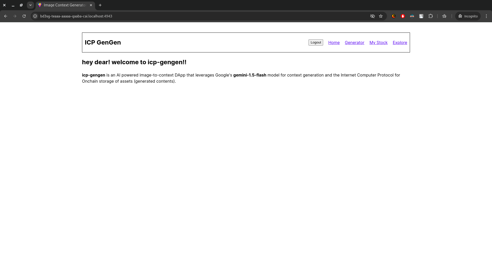
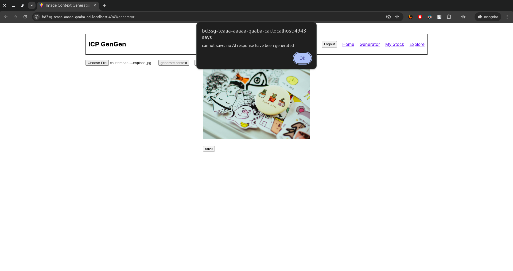
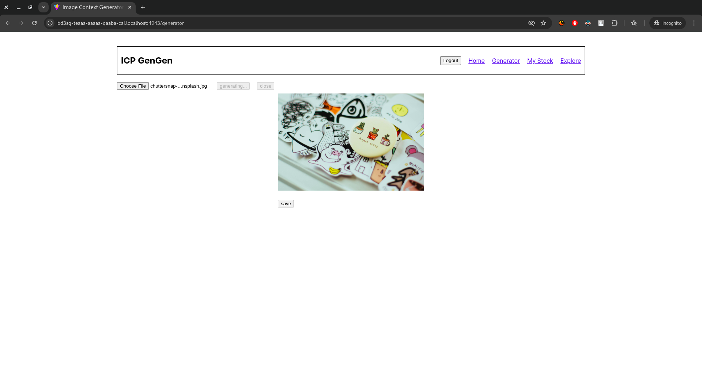
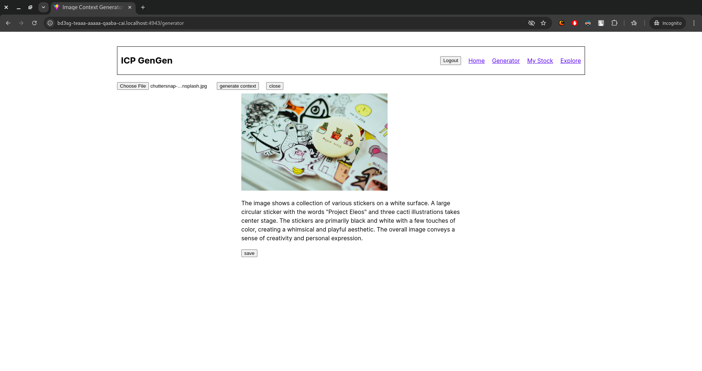
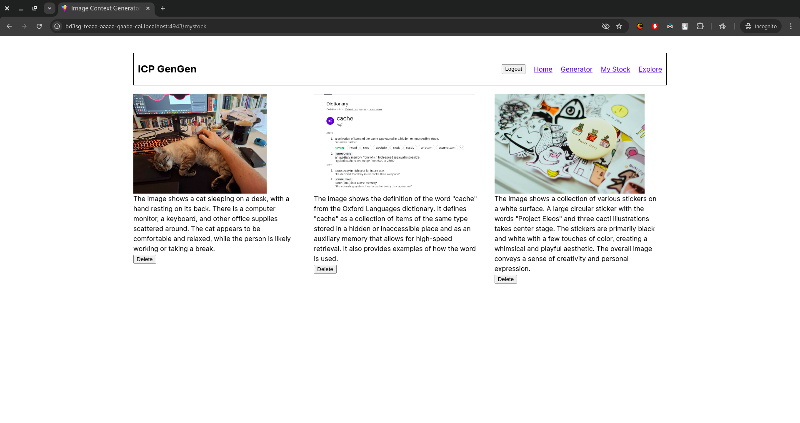
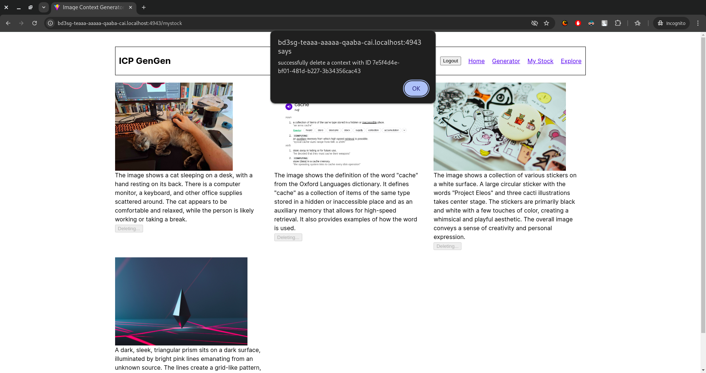
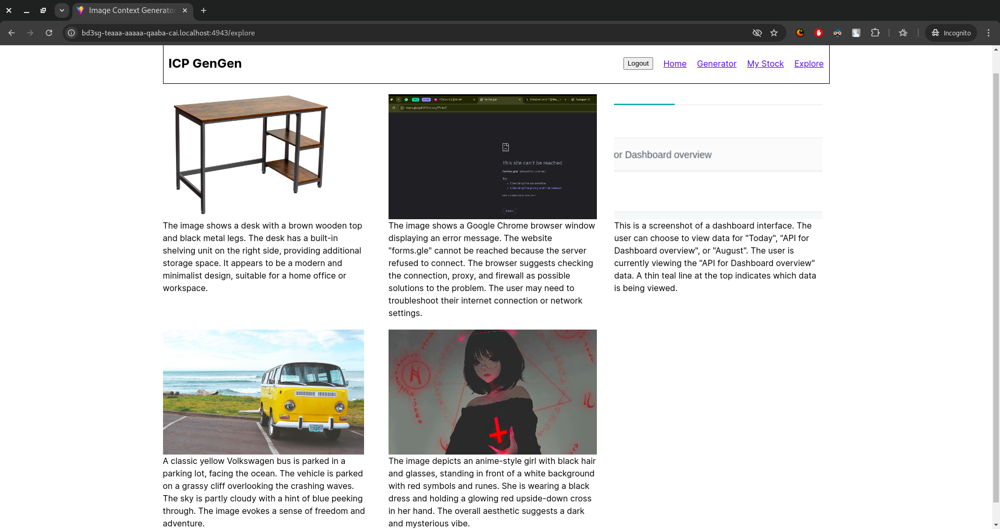

# icp-gengen

**icp-gengen** is an AI-powered image-to-text context generator. This decentralized application lets users upload pictures and get human-like context from google's **gemini-1.5-flash** AI model, pin the uploaded image to the IPFS cloud via **Pinata** and store the generated context and pinned image url on the ICP blockchain. Users can also browse other user-generated contexts on the **explore** page.

## Functionalities

- Generate Context for an uploaded picture
- Save the image and the generated context (text) on the blockchain
- View generated contexts and their images by you
- View generated contexts and their images by others
- Delete generated contexts and their images (only available for contexts you generated)

## Technologies and Tools

- **Contract**: Azle library (Typescript)
- **Backend server**: Express.js (Typescript)
- **Frontend**: React.js (Vite)
- **Image Pinning**: Pinata/IPFS
- **Local ICP Blockchain Runner**: dfx

## Installation and Setup

**NB:** Before proceeding, please make sure you have node **v20+** and dfx **v0.22.0** installed on your machine.

To begin, clone this repository to your machine and create a `.env` file in the root of the application and populate it with the following variables:

```
VITE_GEMINI_API_KEY: your google gemini api key
VITE_PINATA_GATEWAY: your pinata gateway baseurl
VITE_PINATA_JWT_KEY: your pinata JWT string
```

Now, run the following commands as they appear below to complete the installation and setup process:

- `npm install` to install required dependencies
- `npm run dfx:start` to initialize the local ICP blockchain
- `npm run dfx:deploy` to deploy the canisters (smart contracts) on the local blockchain
- `npm run dfx:generate` to generate **declaration** files neccessary for the frontend to communicate with the backend.

To interact with the application via your browser, scroll through your terminal output and click on the link with asteriks (\*) arround it as shown below:

```
Deployed canisters.
URLs:
  Frontend canister via browser
    frontend:
      - http://127.0.0.1:4943/?canisterId=bd3sg-teaaa-aaaaa-qaaba-cai
      - **http://bd3sg-teaaa-aaaaa-qaaba-cai.localhost:4943/**
  Backend canister via Candid interface:
    backend: http://127.0.0.1:4943/?canisterId=br5f7-7uaaa-aaaaa-qaaca-cai&id=bkyz2-fmaaa-aaaaa-qaaaq-cai
    internet_identity: http://127.0.0.1:4943/?canisterId=br5f7-7uaaa-aaaaa-qaaca-cai&id=be2us-64aaa-aaaaa-qaabq-cai
```

**NB:** Your output will not have asteriks (\*), as they are used here as a guide.

## Screenshots

Here are some screenshots that show the application in use.

**Home Page**



**Context Generation Pages**







**My Stock Page**



**Deleting a Context from My Stock Page**



**Explore Page**


